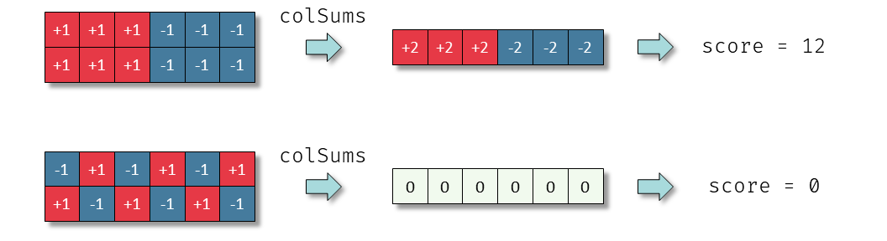
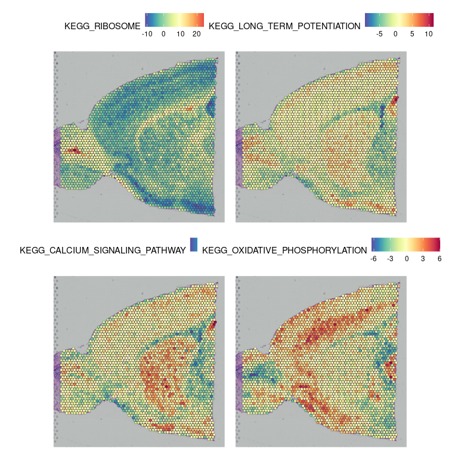

```{r, include = FALSE}
knitr::opts_chunk$set(
  collapse = TRUE,
  comment = "#>"
)
```

```{r echo=FALSE}
library(BiocParallel)
register(SerialParam())
```

This vignette describes GESECA (gene set co-regulation analysis): a method
to identify gene sets that have high gene correlation.
We will show how GESECA can be used to find regulated pathways
in multi-conditional data, where there is no obvious contrast that 
can be used to rank genes for GSEA analysis.
As examples we will consider a time course microarray experiment 
and a spatial transcriptomics dataset.

## Overiew of GESECA method

GESECA takes as an input:

* *E* - gene expression matrix, where rows and columns correspond to genes and samples respectively.
* *P* - list of gene sets (i.e. 
[hallmark gene sets](http://www.gsea-msigdb.org/gsea/msigdb/human/collections.jsp#H)).

**Note**: genes identifier type should be the same for both elements of *P* and for row names of matrix *E*.

By default, GESECA method performs centering for rows of the matrix *E*. 
So, after that, the gene values are assumed to have zero mean.
Then for each gene set *p* in *P* let us introduce the gene set score in the following form:

```{r eval=FALSE}
score <- sum(colSums(E[p, ])**2) / length(p)
```

This score was inspired by the variance of principal components 
from the principal component analysis (PCA).
Therefore, the given score can be viewed in terms of explained variance by the gene set *p*.
Geometrically, this can be considered as an embedding of samples into 
a one-dimensional space, given by a unit vector in which nonzero 
positions correspond to genes from gene set *p*.

In the case of row-centered matrix *E* the variance of 
highly correlated genes is summed up to a higher score.
While the genes that are not correlated cancel each other and the total
gene set variance is low.
See the toy example:

{width=90%}

Another major feature of the proposed score is that it does not require 
an explicit sample annotation or a contrast.
As the result, GESECA can be applied to various types of sequencing technologies: RNA-seq, single-cell sequencing, spatial RNA-seq, etc.

To assess statistical significance for a given gene set *p* we calculate 
an empirical P-value by using gene permutations.
The definition of the P-value is given by the following expression:
\[
    \mathrm{P} \left(\text{random score} \geqslant \text{score of p} \right).
\]
The estimation of the given P-value is done by sampling random gene sets 
with the same size as *p* from the row names of matrix *E*.
In practice, the theoretical P-value can be extremely small, 
so we use the adaptive multilevel Markov Chain Monte Carlo scheme,
that we used previously in `fgseaMultilevel` procedure.
For more details, see the [preprint](https://www.biorxiv.org/content/10.1101/060012v3).

## Analysis of time course data

In the first example we will consider a time course data of Th2 activation
from the dataset GSE200250.

First, let prepare the dataset. We load it from Gene Expression Omnibus,
apply log and quantile normalization and filter lowly expressed genes.

```{r message=FALSE}
library(GEOquery)
library(limma)

gse200250 <- getGEO("GSE200250", AnnotGPL = TRUE)[[1]]

es <- gse200250
es <- es[, grep("Th2_", es$title)]
es$time <- as.numeric(gsub(" hours", "", es$`time point:ch1`))
es <- es[, order(es$time)]

exprs(es) <- normalizeBetweenArrays(log2(exprs(es)), method="quantile")

es <- es[order(rowMeans(exprs(es)), decreasing=TRUE), ]
es <- es[!duplicated(fData(es)$`Gene ID`), ]
rownames(es) <- fData(es)$`Gene ID`
es <- es[!grepl("///", rownames(es)), ]
es <- es[rownames(es) != "", ]

fData(es) <- fData(es)[, c("ID", "Gene ID", "Gene symbol")]

es <- es[head(order(rowMeans(exprs(es)), decreasing=TRUE), 12000), ]
head(exprs(es))
```


Then we obtain the pathway list. Here we use Hallmarks
collection from MSigDB database.


```{r}
library(msigdbr)
pathwaysDF <- msigdbr("mouse", category="H")
pathways <- split(as.character(pathwaysDF$entrez_gene), pathwaysDF$gs_name)
```

Now we can run GESECA analysis:

```{r message=FALSE}
library(fgsea)
set.seed(1)
gesecaRes <- geseca(pathways, exprs(es), minSize = 15, maxSize = 500)
```

The resulting table contain GESECA scores and the corresponding P-values:
```{r}
head(gesecaRes, 10)
```

We can plot gene expression profile of HALLMARK_E2F_TARGETS pathway and see
that these genes are strongly activated at 24 hours time point:


```{r fig.width=10, fig.height=4, out.width="100%"}
plotCoregulationProfile(pathway=pathways[["HALLMARK_E2F_TARGETS"]], 
                        E=exprs(es), titles = es$title, conditions=es$`time point:ch1`)
```

Hypoxia genes have slightly different profile, getting activated around 48 hours:


```{r fig.width=10, fig.height=4, out.width="100%"}
plotCoregulationProfile(pathway=pathways[["HALLMARK_HYPOXIA"]], 
                        E=exprs(es), titles = es$title, conditions=es$`time point:ch1`)


```

To get an overview of the top pathway patterns we can use `plotGesecaTable`
function:

```{r fig.width=10, fig.height=6, out.width="100%"}
plotGesecaTable(gesecaRes |> head(10), pathways, E=exprs(es), titles = es$title)
```

When the expression matrix contains many samples, a PCA-reduced expression matrix
can be used instead of the full matrix to improve the performance. 
Let reduce the sample space from `r ncol(es)` to 10 dimensions, preserving as much gene variation as possible.

```{r}
E <- t(base::scale(t(exprs(es)), scale=FALSE))
pcaRev <- prcomp(E, center=FALSE)
Ered <- pcaRev$x[, 1:10]
dim(Ered)
```

Now we can run GESECA on the reduced matrix, however we need to disable automatic centering, as we already have done it before the reduction.

```{r}
set.seed(1)
gesecaResRed <- geseca(pathways, Ered, minSize = 15, maxSize = 500, center=FALSE)
head(gesecaResRed, 10)
```

The scores and P-values are similar to the ones we obtained for the full matrix.

```{r fig.width=4, fig.height=4}
library(ggplot2)
ggplot(data=merge(gesecaRes[, list(pathway, logPvalFull=-log10(pval))],
                  gesecaResRed[, list(pathway, logPvalRed=-log10(pval))])) +
    geom_point(aes(x=logPvalFull, y=logPvalRed)) +
    coord_fixed() + theme_classic()
```


## Analysis of single-cell RNA-seq

Les us load neccesary libraries. We a going to use `Seurat` package for working with singe cell data.

```{r}
library(Seurat)
```

As an example dataset we will use GSE116240 (https://www.ncbi.nlm.nih.gov/geo/query/acc.cgi?acc=GSE116240).
The dataset features single cell RNA sequencing of aortic CD45+ cells 
and foam cells from atherosclerotic aorta and is extensively described 
in the corresponding publication (https://pubmed.ncbi.nlm.nih.gov/30359200/).
We also thank the authors for providing the corresponding Seurat object
used for the publication.

```{r fig.width=8, fig.height=3.5}
obj <- readRDS(url("https://ctlab.itmo.ru/files/software/fgsea/GSE116240.rds"))
obj

newIds <- c("0"="Adventitial MF",
            "3"="Adventitial MF",
            "5"="Adventitial MF",
            "1"="Intimal non-foamy MF",
            "2"="Intimal non-foamy MF",
            "4"="Intimal foamy MF",
            "7"="ISG+ MF",
            "8"="Proliferating cells",
            "9"="T-cells",
            "6"="cDC1",
            "10"="cDC2",
            "11"="Non-immune cells")

obj <- RenameIdents(obj, newIds)

DimPlot(obj) + ggplot2::coord_fixed()
```

We apply an appropriate normalization (note that we are using 10000 genes, 
which will be later used as a gene universe for the analysis):

```{r}
obj <- SCTransform(obj, verbose = FALSE, variable.features.n = 10000)
```

To speed up the analysis, instead of using the full transformed
gene expression matrix, we will consider only its first 
principal components. Note that a "reverse" PCA should be done: 
the principal components should correspond to linear combinations
of the cells, not linear combinations of the genes as in "normal" PCA.
By default `SCTransform` returns centered gene expression, so we
can run PCA directly.

```{r}
length(VariableFeatures(obj)) # make sure it's a full gene universe of 10000 genes
obj <- RunPCA(obj, assay = "SCT", verbose = FALSE,
                rev.pca = TRUE, reduction.name = "pca.rev",
              reduction.key="PCR_", npcs = 50)

E <- obj@reductions$pca.rev@feature.loadings
```

Following the authors we are going to use KEGG pathway collection.

```{r}
library(msigdbr)

pathwaysDF <- msigdbr("mouse", category="C2", subcategory = "CP:KEGG")
pathways <- split(pathwaysDF$gene_symbol, pathwaysDF$gs_name)
```

Now we can run the analysis (we set `center=FALSE` because we use the 
reduced matrix):


```{r}
set.seed(1)
gesecaRes <- geseca(pathways, E, minSize = 5, maxSize = 500, center = FALSE, eps=1e-100)

head(gesecaRes, 10)
```


Now we can plot profiles of the top pathways (we need to specify the reduction
as we are using the one from the publication):

```{r fig.width=12, fig.height=7, out.width="100%"}
topPathways <- gesecaRes[, pathway] |> head(4)
titles <- sub("KEGG_", "", topPathways)

ps <- plotCoregulationProfileReduction(pathways[topPathways], obj,
                                       title=titles,
                                       reduction="tsne")
cowplot::plot_grid(plotlist=ps[1:4], ncol=2)
```

We can see that inflammatory pathways (e.g. KEGG_LEISHMANIA_INFECTION) are 
more associated with the non-foamy intimal macrophages, which was one of the
main points of the Kim et al. Another pathway highlighted by the authors, KEGG_LYSOSOME, is specific to intimal foamy macrophages:

```{r fig.width=5, fig.height=3.5, out.width="50%"}
plotCoregulationProfileReduction(pathways$KEGG_LYSOSOME, 
                               obj,
                               title=sprintf("KEGG_LYSOSOME (pval=%.2g)",
                                             gesecaRes[match("KEGG_LYSOSOME", pathway), pval]),
                               reduction="tsne")
```

## Analysis of spatial RNA-seq

Similarly to single cell RNA-seq, GESECA can be applied to spatial
transcriptomics profiling. As an example we will use glioblastoma 
sample from Ravi et al (https://pubmed.ncbi.nlm.nih.gov/35700707/).

```{r message=FALSE}
library(Seurat)

obj <- readRDS(url("https://ctlab.itmo.ru/files/software/fgsea/275_T_seurat.rds"))
```


As for scRNA-seq, we apply normalization for 10000 genes and run a do a PCA reduction.

```{r}
obj <- SCTransform(obj, assay = "Spatial", verbose = FALSE, variable.features.n = 10000)

obj <- RunPCA(obj, assay = "SCT", verbose = FALSE,
                rev.pca = TRUE, reduction.name = "pca.rev",
              reduction.key="PCR_", npcs = 50)

E <- obj@reductions$pca.rev@feature.loadings
```

We will use HALLMARK pathways as the gene set collection.

```{r}
library(msigdbr)
pathwaysDF <- msigdbr("human", category="H")
pathways <- split(pathwaysDF$gene_symbol, pathwaysDF$gs_name)
```

Now we can run the analysis (remember, we set `center=FALSE` because we use the 
reduced matrix):

```{r}
set.seed(1)
gesecaRes <- geseca(pathways, E, minSize = 15, maxSize = 500, center = FALSE)

head(gesecaRes, 10)
```

Finally, let us plot spatial expression of the top four pathways:

```{r fig.width=10, fig.height=7, out.width="100%"}

topPathways <- gesecaRes[, pathway] |> head(4)
titles <- sub("HALLMARK_", "", topPathways)

ps <- plotCoregulationProfileSpatial(pathways[topPathways], obj,
                                       title=titles)
cowplot::plot_grid(plotlist=ps, ncol=2)
```

<!-- {width=100%} -->

Consistent with the Ravi et al, we see a distinct hypoxic region (defined by HALLMARK_HYPOXIA) and a reactive immune region (defined by HALLMARK_INTERFERON_GAMMA_RESPONSE). Further, we can explore behavior of 
HALLMARK_OXIDATIVE_PHOSPHORYLATION pathway to see that oxidative metabolism
is more characteristic to the "normal" tissue region:

```{r fig.width=5, fig.height=3.5, out.width="50%"}
plotCoregulationProfileSpatial(pathways$HALLMARK_OXIDATIVE_PHOSPHORYLATION,
                               obj,
                               title=sprintf("HALLMARK_OXIDATIVE_PHOSPHORYLATION (pval=%.2g)",
                                             gesecaRes[
                                                 match("HALLMARK_OXIDATIVE_PHOSPHORYLATION", pathway),
                                                 pval]))
```
